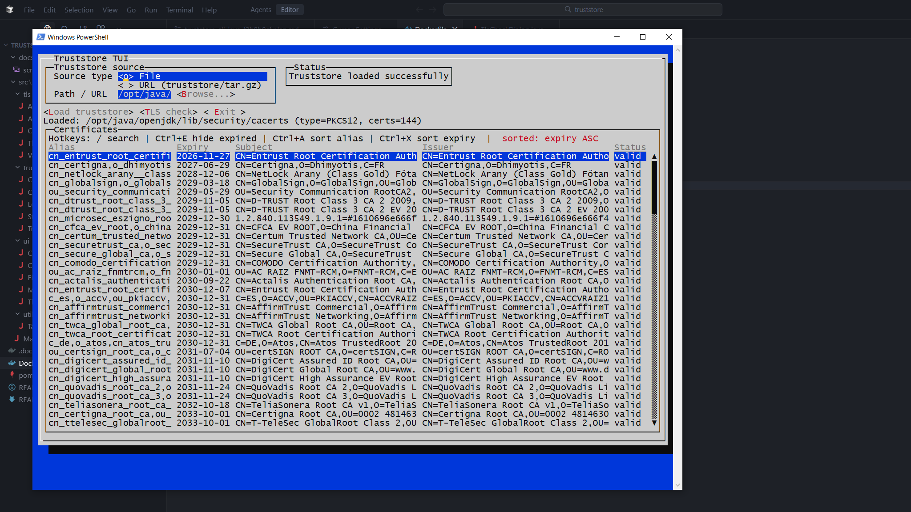

# Truststore TUI

Terminal UI tool to inspect Java truststores (`JKS`/`PKCS12`) and run TLS validation.

Russian documentation: see `README.ru.md`.

## Screenshot

TUI started with Java default truststore (`cacerts`) containing 144 certificates.



## Features

- Load truststore from local file.
- Load truststore from local `tar.gz` / `tgz` (archive must contain exactly one file).
- Load truststore from URL (either direct truststore file or `tar.gz` / `tgz`).
- Browse certificates (`alias`, expiry, `subject`, `issuer`, status).
- TLS check against `host:port`:
  - with the full truststore;
  - with a single selected certificate.
- Find matching aliases for a target endpoint with progress (`checked/total`).

## Requirements

- Java 17+ (for local run)
- Maven 3.9+ (for local build)
- Docker (recommended)

## Local Build and Run

```bash
mvn -DskipTests package
java -jar target/truststore-tui-1.0.0-jar-with-dependencies.jar
```

## Docker

Build:

```bash
docker build -t truststore-tui:latest .
```

Run (interactive TUI):

```bash
docker run --rm -it -e TRUSTSTORE_PASSWORD="your_password" truststore-tui:latest
```

Run with Windows `Downloads` mounted read-only:

```bash
docker run --rm -it -e TRUSTSTORE_PASSWORD="your_password" -v "C:\Users\toush\Downloads:/downloads:ro" truststore-tui:latest
```

Use container paths in TUI (for example `/downloads/yourstore.jks`).

## Environment Variables

- `TRUSTSTORE_PASSWORD` (optional): truststore password. Default is `changeit`.
- `TRUSTSTORE_PATH` (optional): local truststore path inside container/host FS.
- `TRUSTSTORE_URL` (optional): URL to truststore file or `tar.gz` / `tgz`.

Startup behavior:

- only `TRUSTSTORE_PATH` is set: load from file automatically;
- only `TRUSTSTORE_URL` is set: load from URL automatically;
- both are set: ask which source to use;
- none is set: ask whether to use `File` or `URL`.

## Quick Usage

1. Select `Source type` (`File` or `URL`).
2. Fill `Path / URL` (or click `Browse...` for file mode).
3. Click `Load truststore`.
4. Open `TLS check`, enter `Host` and `Port`, run check.
5. Optionally enable `Find matching certificates` to get valid aliases list.

## Hotkeys

Certificate table:

- `/`: case-insensitive search with highlighting.
- `Ctrl+E`: hide/show expired certificates.
- `Ctrl+A`: sort by alias (`ASC/DESC` toggle).
- `Ctrl+X`: sort by expiry (`ASC/DESC` toggle).
- `Left` / `Right`: horizontal scroll for long `Subject`.
- `Enter`: open certificate details (`TLS only this cert` available there).

File picker:

- `Enter` on folder or `..`: open/go up.
- `Enter` on file: select file.
- `Ctrl+N`: sort by name (`ASC/DESC`).
- `Ctrl+D`: sort by modified date (`ASC/DESC`).

## Common Errors

- `Failed to load truststore. Check password and store format (JKS/PKCS12).`
  - wrong password or unsupported file format.
- `tar.gz must contain exactly one file`
  - archive is empty or contains multiple files.
- `Invalid URL: ...`
  - malformed URL (missing scheme/host).
- `TLS validation failed: ...`
  - DNS/connectivity/timeout/SSL handshake issue.
